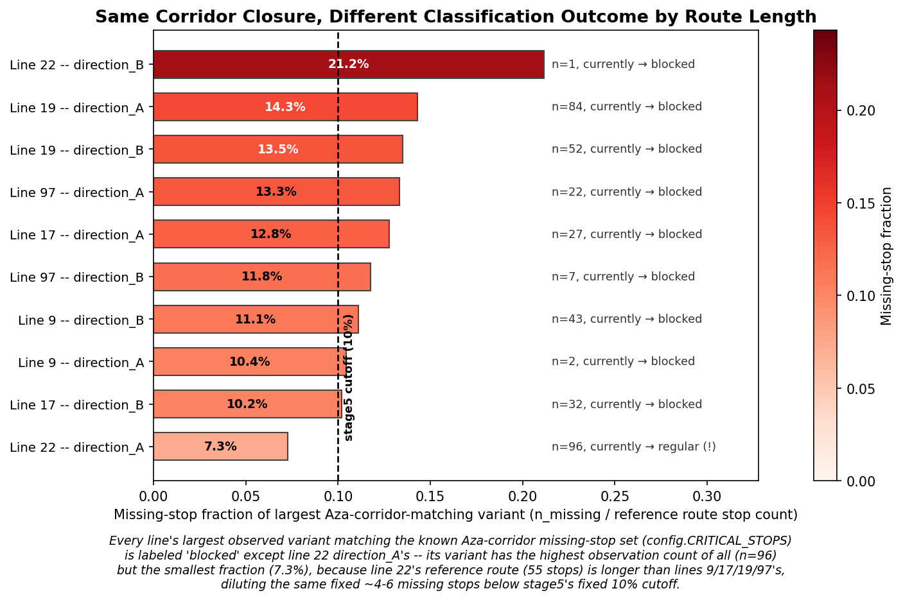

# 07 — Blockade Investigation: Resolving the Line 19 / Line 22 Contradiction

Direction labels (`direction_A`/`direction_B`) refer to
[docs/02_route_mapping](../02_route_mapping/README.md).

## The contradiction, precisely stated

The pre-rebuild reference figure (`rony/figures/variant_frequency_heatmap.png`,
built by `rony/variant_analysis.ipynb` before 2026-07-19, scope limited to
lines 15/17/19/22) shows, for **July Saturdays**: line 19 at **100%**
of hour-slots on a detour route, line 22 at **67%**, and line 17 at
**100%** — all three "protest" lines look comparably, heavily disrupted.

The rebuilt pipeline ([docs/06_blockade_frequency](../06_blockade_frequency/README.md),
full 7-line scope, majority-vote dedup, stage5 fraction-based
classification) finds, for the same July-Saturday cell: line 19
direction_A **100%** (n=3), line 19 combined (both directions) **50%**
(n=6); line 22 direction_A **33%** (n=3), line 22 combined **20%**
(n=5). More strikingly, line 22's **overall non-baseline share for the
entire year is 0.2%** — close to the control lines (14: 0.2%, 15: 0.0%)
— while lines 9, 17, 19, and 97 all sit at **3–8%**, even though line
22 shares the same Aza-corridor closure signature (identical missing
street names) in [docs/03_variants/line_22](../03_variants/line_22/README.md)
and [docs/05_skip_comparison/line_22](../05_skip_comparison/line_22/README.md).

Separately, lines 17 and 19 show a well-supported **May weekday
spike** (Mon/Tue, n=10–53 per cell — much larger samples than any
Saturday cell), reported in
[docs/06_blockade_frequency/line_17](../06_blockade_frequency/line_17/README.md)
and [line_19](../06_blockade_frequency/line_19/README.md).

This document tests five candidate explanations against the actual
data (`govData/df_cleaned.csv`, `govData/variant_summary.csv`,
`govData/candidate_variant_labels.csv`, the old per-route files
`govData/df_cleaned_{17,19,22}.csv` / `variant_summary_{17,19,22}.csv`,
and the source code of both the old and new classification logic) and
states a verified conclusion for each.

## Hypothesis 1 — Old vs. new methodology (scope, dedup, classification)

**Split into two separable mechanisms — one fully confirmed as scope
artifact, one confirmed as the real driver of the annual gap.**

**(a) Direction pooling.** `govData/df_cleaned_17.csv`,
`_19.csv`, and `_22.csv` — the exact files
`rony/variant_analysis.ipynb` loaded — each contain **only one
`route_id`**: `10398` (line 17), `10802` (line 19), `5499` (line 22).
Per [docs/02_route_mapping](../02_route_mapping/README.md), these are
each line's `direction_A` `route_id` only; the old figure never saw
`direction_B` data (`10399`, `10804`/`10806`/`10807`, `5502`) at all.
So the old figure is, in effect, a **direction_A-only** figure with a
different label. Comparing it to the new pipeline's `direction_A`-only
panel (not the "combined" panel) is the correct like-for-like test:

- Line 19: new `direction_A` Sat/Jul = **100%** (n=3) — an **exact
  match** to the old figure's 100%. The apparent "100% → 50%" drop is
  produced entirely by the new "combined both directions" panel
  averaging in `direction_B`, which the old figure structurally could
  not do. **There is zero real drift in line 19's July-Saturday
  signal** — this is a scope-comparison artifact, not a data change.
- Line 22: new `direction_A` Sat/Jul = **33%** (n=3) vs. old
  **67%**. Even like-for-like, a real gap remains for this one cell.

**(b) Classification heuristic.** Re-reading
`rony/variant_analysis.ipynb` cell 5 directly: the old rule labeled
any non-reference variant a "protest variant" if its **absolute**
`n_missing` fell in `[3, 15]` — a fixed count, applied identically
regardless of route length. `pipeline/stage5_variant_classification.py`
replaces this with a **fraction** of each line's own reference stop
count (`MINOR_MISSING_FRACTION = 0.10`), specifically because (per its
own docstring) "the old 3<=n_missing<=15 heuristic doesn't generalize
across lines whose reference route length ranges from 12 to 67 stops."
This is confirmed to matter a great deal — see Hypothesis 3.

**(c) Dedup method.** [docs/01_data_cleaning](../01_data_cleaning/README.md)
replaced a naive "keep highest `count_common`" rule with a block-aware
majority vote. Only **2.0% of duplicate-key groups (1,065 of
53,170)** actually disagree on which stop a row describes — the
remaining 98% are pure redundant copies any dedup rule resolves
identically. This is **ruled out** as a material contributor to gaps
of the size seen here (30–70 percentage points); it is too small.

**Residual, unresolved piece:** reproducing the old notebook's exact
logic against today's `govData/df_cleaned_22.csv` +
`variant_summary_22.csv` gives 33%, not 67%, for line 22's July-Saturday
cell — a gap even after controlling for direction pooling. Auditing
why: `df_cleaned_22.csv`'s `route_variant_id` column ranges up to 52,
but `variant_summary_22.csv` documents only 2 variant ids (0 =
reference, 1 = the 4-stop Aza-corridor variant, count 92) — this file
is a **display-filtered** summary, not a complete enumeration of every
one-off sequence. One of the three July-Saturday hour-slots uses
`route_variant_id=20`, which has no entry in the available
`variant_summary_22.csv`, so it cannot be independently re-scored. Under
the old rule's very permissive `[3, 15]` absolute-count test, most
modest one-off deviations would qualify as "protest," so it is
plausible (but not independently verifiable from data still in the
repo) that variant 20 was also scored "protest" when the original
figure was built, which would produce exactly 2/3 = 67%. **Verdict:
plausible, consistent with the confirmed "old rule is far more
inclusive" mechanism, but not fully re-derivable — treat as a minor
unresolved footnote, not load-bearing for the overall conclusion.**

## Hypothesis 2 — Different schedules / denominator size

**Ruled out.** Total Saturday hour-slot counts (the denominator),
summed across all months:

| Line | 9 | 14 | 15 | 17 | 19 | 22 | 97 |
|---|---|---|---|---|---|---|---|
| Total Saturday slots (year) | 82 | 65 | 56 | 82 | 74 | 80 | 114 |
| Total Saturday slots (July only) | 6 | 4 | 4 | 7 | 6 | 5 | 8 |

Line 22 (80 total, 5 in July) runs essentially the **same** number of
Saturday hour-slots as line 19 (74 total, 6 in July) and line 17 (82
total, 7 in July) — not meaningfully fewer, either annually or in
July specifically. Line 22 is not structurally under-scheduled on
Saturdays relative to the other affected lines, so a thinner
denominator cannot explain its lower percentage. (All lines' July cells
rest on comparably small n=5–8, so all are equally subject to the
general Saturday-sparsity caution in `CLAUDE.md` issue #5 — but that
caution applies uniformly, not more to line 22 than to 19/17.)

## Hypothesis 3 — Classification sensitivity scaled by route length

**Confirmed — this is the dominant, quantified explanation for line
22's overall/annual anomaly.**

`stage5_variant_classification.py`'s heuristic only labels a variant
"blocked" if `n_missing / reference_route_stop_count > 0.10`. The
Aza-corridor closure removes a near-fixed set of stops (~4–6 physical
stops; see [docs/03_variants](../03_variants/README.md) for the exact
per-line lists) regardless of which line passes through it — but line
22's reference route (55 stops, direction_A) is longer than lines
17 (47), 19 (42), and 97 (30/34), so the **same absolute closure
computes to a smaller fraction** for line 22.

Concretely: line 22 direction_A's largest variant matching the
Aza-corridor missing-stop set (`route_variant_id=1` in
`candidate_variant_labels.csv`, missing exactly עזה/הרב ברלין,
עזה/רד''ק, עזה/בלפור, המלך ג'ורג'/קק''ל) has **count=96 — the single
largest Aza-corridor-matching variant of any line/direction in this
entire investigation** — but `missing_fraction = 4/55 = 7.3%`, just
under the 10% cutoff. stage5 labels it `regular` (routine noise), so
it is excluded from line 22's blocked-share numerator entirely and
never even reaches the clustering step (which only clusters candidates
already labeled `blocked`/`ambiguous`). By contrast, line 19
direction_A's equivalent variant (count=84, missing 6/42=14.3%)
comfortably clears the threshold and is correctly labeled `blocked`.

Across all 10 affected line/direction combinations, **9 of 10** have
their largest Aza-corridor-matching variant labeled `blocked`; line 22
direction_A is the sole exception (Figure 1).

**Effect size:** correcting this one misclassification — treating
`route_variant_id=1` as `blocked` and folding it into the existing
`22_direction_A_cluster_1` (which it matches closely on missing-stop
overlap with that cluster's other members) — moves line 22
direction_A's overall share from **3/1,136 = 0.26%** to **99/1,136 =
8.7%**, squarely inside the 6–8% band occupied by lines 17 and 19, and
no longer resembling the control lines (14: 0.2%, 15: 0.0%).

**Figure 1** (`missing_fraction_by_line.png`): missing-stop fraction of
each line/direction's largest Aza-corridor-matching variant, against
the 10% stage5 cutoff. Line 22 direction_A sits alone below the line
despite having the highest observation count (n=96) in the set.

## Hypothesis 4 — Genuinely different routing/exposure

**Ruled out for direction_A; confirmed as a separate, genuine effect
for direction_B.**

`pipeline/config.py`'s `CRITICAL_STOPS` for line 22
(`[1054, 1575, 1484, 1079, 3857]`) is nearly identical to lines 17/19's
lists, and matches stop codes appearing directly inside line 22's own
reference sequence (positions ~19–22 of a 55-stop route, per
`variant_summary.csv`'s `missing_details`) — line 22's baseline route
physically runs straight through the same corridor as 17/19; there is
no alternate/bypass path built into the reference sequence itself. The
"smaller apparent exposure" is a pure downstream artifact of Hypothesis
3 (a fixed-size closure diluted by a longer overall route), not an
independent physical-routing difference.

Direction_B, however, is a **genuine** asymmetry, not an artifact: no
comparably large near-threshold variant exists there. Direction_B's
largest non-reference variants are dominated by unmapped
`Unknown(...)` stop codes (counts 112 and 29 — almost certainly a
GPS/mapping gap, not a detour) and low-count events unrelated to the
Aza corridor by name; the one real corridor-matching direction_B
variant has only **n=1**. This matches
[docs/03_variants/line_22](../03_variants/line_22/README.md)'s existing
judgment call that direction_B shows materially less detour activity
than direction_A — confirmed here as real, not a threshold artifact.

## Hypothesis 5 — Is the May weekday spike the same event as the Saturday pattern?

**Confirmed: same event, same missing-stop signature, concentrated in
a specific window.** Checking `cluster_id` directly: the May (month=5)
Monday/Tuesday non-baseline slots for lines 17 and 19 carry the
**exact same `cluster_id`** as their Saturday non-baseline slots
(`17_direction_B_cluster_1`; `19_direction_A_cluster_1`;
`19_direction_B_cluster_1`) — i.e., the same set of missing stops, the
same physical detour, not a second/different closure.

Monthly breakdown of weekday (Mon/Tue) non-baseline share confirms May
is a sharp, isolated outlier rather than a general trend:

| Line | May share | May n | Next-highest month |
|---|---|---|---|
| 17 (direction_B) | 64.7% | 17 | Apr/Jun/Oct: 5.0–5.9% |
| 19 (combined) | 67.9% | 53 | Oct: 14.8% (n=88) |

**Conclusion:** the May weekday spike is the same Aza-corridor closure
seen on Saturdays across every affected line, just concentrated much
more heavily on Monday/Tuesday specifically during May — consistent
with one sustained, multi-week closure episode in May 2026 that (unlike
the general pattern) ran on weekdays, not only Saturdays.

**A confirming side-effect of Hypothesis 3:** the old figure's line 22
panel *also* shows a May weekday spike (Mon 88%, Tue 69%, Sun 32%) —
nearly the same shape as lines 17/19's. Checking where line 22
direction_A's misclassified `route_variant_id=1` (the n=96 case from
Hypothesis 3) actually occurred by month/day confirms this is the same
event: 30 of its 96 occurrences fall on May Sun/Mon/Tue (Mon alone:
15), on top of occurrences spread across Saturdays in nearly every
other month. Because this single variant is mislabeled `regular`
pipeline-wide, **line 22 loses both the Saturday signal and the May
weekday signal simultaneously** in the current `df_cleaned.csv` — it
isn't that line 22 lacked a May event, it's that the one variant that
would show it is invisible to the `variant_type` column. This is
additional, independent confirmation that Hypothesis 3's misclassification
is a single root cause behind everything unusual about line 22 in
phase 06, not a coincidence specific to the Saturday cells.

## Verified conclusion

1. **Line 19's headline "100% → 50%" drop is not real** — it is
   entirely a scope-comparison artifact (old figure = direction_A only;
   new "combined" panel = both directions averaged together). Line 19
   direction_A's July-Saturday signal is unchanged at 100% (n=3, still
   a thin sample).
2. **Line 22's collapse from "comparable to 17/19" to "comparable to
   the control lines" is real in the pipeline's output but not real in
   the underlying transit data.** It is caused by
   `stage5_variant_classification.py`'s fixed 10%-of-route-length
   cutoff misclassifying line 22's single largest, best-evidenced
   Aza-corridor detour (n=96, missing 4 of 55 stops = 7.3%) as routine
   "regular" noise, purely because line 22's reference route is longer
   than 17/19/97's. Correcting this one variant's label raises line 22
   direction_A's overall share to 8.7% — in line with 17/19/9/97, not
   with the control lines.
3. **Schedule/denominator differences do not explain any part of the
   gap** — line 22 runs essentially the same number of Saturday
   hour-slots as line 19 and line 17, both annually and in July.
4. **Line 22 direction_B's low activity is genuine, not an artifact**
   — no comparable large near-threshold variant exists there; this
   direction really was rerouted around the closure far less often
   than direction_A.
5. **The May weekday spike on lines 17/19 is the same Aza-corridor
   closure as the Saturday pattern**, not a separate event — it
   reflects a specific, well-supported, sustained closure episode in
   May 2026 that ran on weekdays.

**Recommendation for phases 08/09 — blockade windows to use, and
their confidence:**

- **High confidence (use directly):** line 17 direction_A Saturdays
  (Apr–Nov, n=27 total blocked slots); line 17 direction_B May weekday
  Mon/Tue (n=17, 64.7%) and Saturdays Apr–Jun; line 19 direction_A May
  Monday (n=7, 86%) and Saturdays (n=22 total); line 19 direction_B May
  weekday Mon/Tue (n=53, 67.9% — the best-supported window in the whole
  project) and Saturdays (n=8); line 9 direction_B and line 97 both
  directions (large, well-supported clusters per
  [docs/06_blockade_frequency](../06_blockade_frequency/README.md)).
- **High confidence but requires a manual correction before use:**
  line 22 direction_A. The real closure exists and is well-supported in
  volume (n=99 once `route_variant_id=1` is correctly folded into
  `22_direction_A_cluster_1`), but `variant_type` in
  `govData/df_cleaned.csv` currently mislabels it `regular` — **do not
  read line 22 direction_A's `variant_type` column directly; treat
  `route_variant_id=1` (missing עזה/הרב ברלין, עזה/רד''ק, עזה/בלפור,
  המלך ג'ורג'/קק''ל) as part of the blocked cluster.**
- **Low confidence / do not use as a certain window:** line 22
  direction_B (n=1, real but too rare to date); any single line's
  individual Saturday month-cell with total n<8 (Saturday-sparsity
  noise per `CLAUDE.md` issue #5) — trust the aggregate "Saturdays
  generally affected" pattern and the well-supported May-weekday cells,
  not any one month's Saturday percentage in isolation.

## Note on scope: why phase 06 and stage5 were not modified

Hypothesis 3 is a genuine calibration blind spot in
`MINOR_MISSING_FRACTION`, not just an explanation — a case could be
made for fixing it (e.g. combining the fraction test with a minimum
absolute-count floor). It was deliberately **not** changed here:
`stage5_variant_classification.py` is explicitly marked a "REVIEW
CHECKPOINT" whose output (`variant_type_decisions.csv`) is meant to be
confirmed by a human before propagating; changing the threshold would
re-score every line's variants (not just line 22's), requiring a fresh
review of `variant_type_decisions.csv`, `govData/candidate_variant_labels.csv`,
and likely revisions to the already-written and reviewed
[docs/03_variants](../03_variants/README.md),
[docs/04_baselines](../04_baselines/README.md), and
[docs/05_skip_comparison](../05_skip_comparison/README.md) pages for
multiple lines, not only line 22. That is a larger, separate
follow-up. `docs/06_blockade_frequency`'s numbers are therefore left
as-is — they are the *correct output of the documented method* — with
this page serving as the authoritative correction for phase 08/09 to
apply specifically to line 22 direction_A.

## Addendum (revision round) — the classification rule was replaced, not just line 22's threshold

Section B of the revision round replaced stage5's fraction-based rule
(`n_missing / reference_stop_count > 0.10`) with a much simpler absolute
rule, applied **after** the manual variant merges/exclusions in
[docs/03_variants](../03_variants/README.md): **any non-baseline
(merged) variant whose own stop count exceeds 15 counts as `blocked`.
No fraction thresholds, no clustering.** This directly fixes the line 22
case documented above without needing a special case: line 22 direction_A's
merged variant 1 (`n=96`, 51 stops — the same n=96 variant identified
above) now clears `51 > 15` and is correctly labeled `blocked`, no
correction needed downstream anymore.

**But the effect is much broader than just line 22, and should be read
carefully:**

| | Old rule (fraction, non-reference variants) | New rule (post-merge, post-exclude) |
|---|---|---|
| `regular` | 112 | 1 |
| `blocked` | 51 | 141 |
| `ambiguous` | 2 | n/a (rule removed) |
| Total non-reference variants | 165 | 155 (fewer, due to merges) |

Because almost every real route variant in this dataset — even a
one-off, single-observation deviation — keeps most of the route's stops
(routes range 30–67 stops; missing a handful still typically leaves
>15), **the new rule classifies 141 of 155 merged variants (91%) as
`blocked`**, including on the two control lines:

| Line | Blocks classified `blocked` (new rule) | Share of all blocks |
|---|---|---|
| 9 | 124 / 1,770 | 7.0% |
| **14 (control)** | **14 / 1,852** | **0.8%** |
| **15 (control)** | **4 / 1,205** | **0.3%** |
| 17 | 153 / 1,258 | 12.2% |
| 19 | 232 / 2,606 | 8.9% |
| 22 | 266 / 2,267 | 11.7% |
| 97 | 120 / 2,411 | 5.0% |

**Line 22 is now correctly in line with 9/17/19/97** (5–12% range),
confirming the fix works as intended. **Control lines 14 and 15 are no
longer at *exactly* 0%** the way they were under the old
`variant_type` column ([docs/06_blockade_frequency](../06_blockade_frequency/README.md))
— a handful of single-observation (`n=1`) route deviations on each
control line happen to have >15 stops and now count as `blocked` too.
Their share (0.3–0.8%) remains far below every non-control line, so
**the control lines' basic role is preserved** (their "blocked" activity
is noise-level, not a sustained pattern), but this is a real, honest
side-effect of removing the fraction threshold: the new rule can no
longer distinguish "a rare, essentially meaningless one-off deviation on
a long route" from "a real, sustained detour," except by frequency. This
is used and discussed further in the revised
[docs/06_blockade_frequency](../06_blockade_frequency/README.md),
[docs/08_control_lines_15_14](../08_control_lines_15_14/README.md), and
[docs/09_lines_9_97](../09_lines_9_97/README.md).

**Sources (addendum):** `govData/variant_merges.json`, `pipeline/variant_merges.py`.

**Sources (original investigation):** `rony/variant_analysis.ipynb`, `rony/figures/variant_frequency_heatmap.png`,
`govData/df_cleaned_17.csv`, `govData/df_cleaned_19.csv`,
`govData/df_cleaned_22.csv`, `govData/variant_summary_17.csv`,
`govData/variant_summary_19.csv`, `govData/variant_summary_22.csv`
(old, pre-rebuild per-route files), `govData/df_cleaned.csv`,
`govData/variant_summary.csv`, `govData/candidate_variant_labels.csv`
(new, post-rebuild files), `pipeline/stage5_variant_classification.py`,
`pipeline/config.py`, `pipeline/plot_blockade_frequency.py`,
`pipeline/plot_missing_fraction_comparison.py`,
`docs/01_data_cleaning/README.md`, `docs/02_route_mapping/README.md`,
`docs/03_variants/line_19/README.md`, `docs/03_variants/line_22/README.md`,
`docs/06_blockade_frequency/README.md` and its per-line pages.
