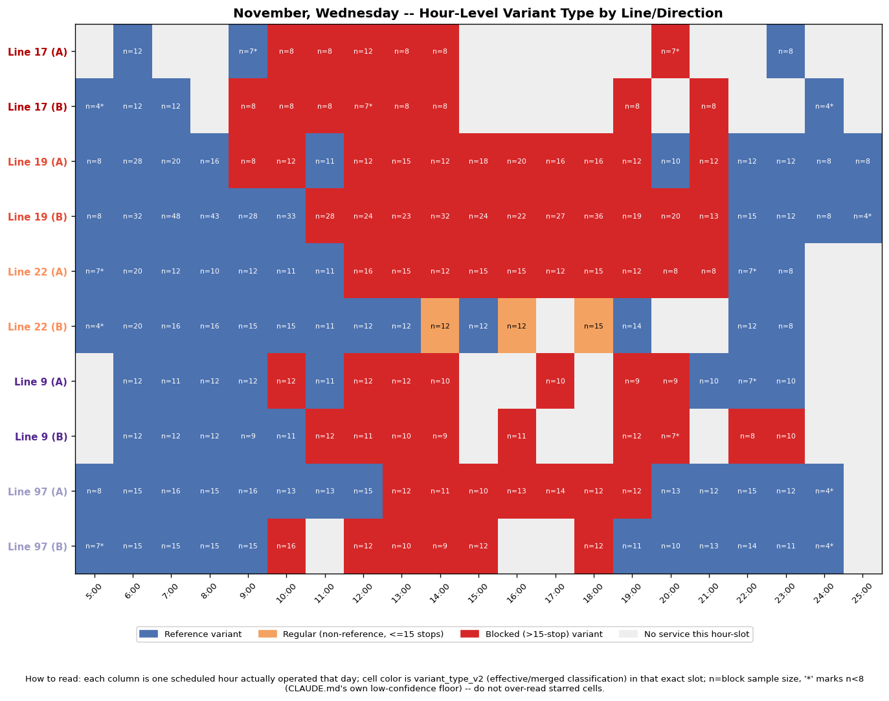
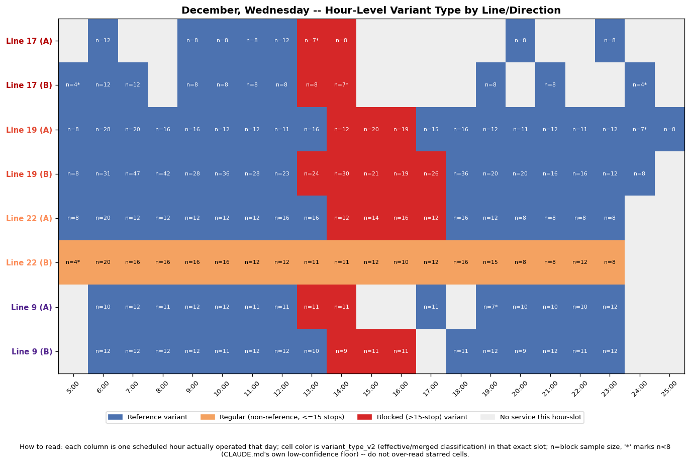
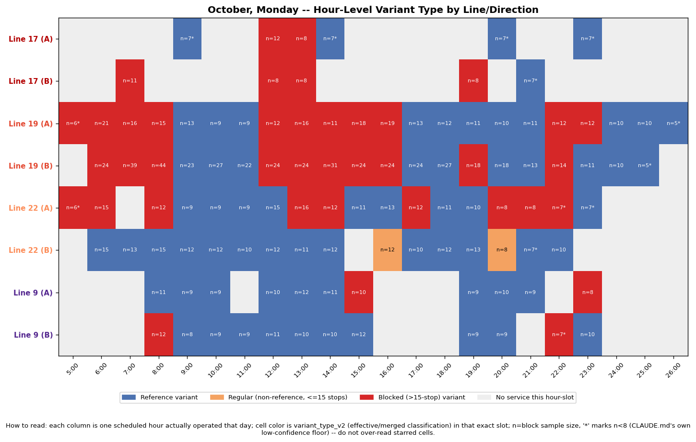

# 11 — Hour-Level Deep Dive on Candidate Windows + Line 22 December Check

**Status: Part B's finding is fixed centrally, `fix_22b_central_prompt.md`.**
Part B below independently diagnosed the same bug already found in
[disagreement_deep_dive.md](../06_blockade_frequency/disagreement_deep_dive.md)
-- line 22 direction_B's non-reference variants clearing the >15-stop
"blocked" threshold on raw stop count despite not touching the corridor
footprint -- and its own "Recommended fix" section proposed exactly the
merge that has now been applied centrally in
`pipeline.variant_merges.LINE_22_NON_CORRIDOR_DIRECTION`. Every number
below that depended on line 22's pooled or direction_B classification has
been recomputed against the corrected data and is called out inline;
Part B's investigative steps and evidence are kept as an accurate record
of how the bug was diagnosed, with its conclusion updated to reflect that
the fix is applied, not merely recommended.

**Purpose:** hour-level follow-up on the three candidate (month, day-of-week)
cells flagged in
[docs/10_candidate_windows/README.md](../10_candidate_windows/README.md) —
cells where several lines show a similar, moderate, non-saturating
blocked-share at once, a pattern distinct from the already-explained
April/June Saturday "majority vs. outlier" case in
[disagreement_deep_dive.md](../06_blockade_frequency/disagreement_deep_dive.md)
— plus a required sub-investigation of line 22's December pattern before
treating it as a finding. All numbers below were recomputed directly from
`govData/df_cleaned.csv` in this pass via
`pipeline.variant_merges.build_effective_df_cleaned` (`variant_type_v2`,
never raw `variant_type`); none were carried over unverified from docs/10.
Reproduce with `python -m pipeline.analyze_deep_dive_windows`.

## Blockade footprints, recomputed

Both footprints are the union of missing-stop-codes of each line/direction's
own highest-count merged variant classified `blocked` (`pipeline.variant_merges.build_effective_variant_summary`),
pulled from `govData/variant_summary.csv`'s `missing_stop_codes` column (a
merged id is always its representative raw id, so this lookup is exact).
Full detail: [footprints.csv](footprints.csv).

| Group | Line/direction | Main blocked variant (id, count, stops) | Missing stops |
|---|---|---|---|
| Corridor (17/19) | 17A | id 2, n=41, 41 stops | 1079, 1080, 1484, 1544, 1546, 1575 |
| | 17B | id 1, n=76, 46 stops | 1073, 1077, 1081 |
| | 19A | id 1, n=91, 36 stops | 1079, 1080, 1484, 1544, 1546, 1575 |
| | 19B | id 1, n=114, 34 stops | 1073, 1077, 1081 |
| Aza St. (9/97) | 9A | id 2, n=44, 64 stops | 1072, 1077, 1543 |
| | 9B | id 2, n=54, 56 stops | 1060, 1079, 1080, 1484, 1544, 1546, 1787 |
| | 97A | id 1, n=37, 26 stops | 1060, 1079, 1484, 1787 |
| | 97B | id 1, n=27, 32 stops | 1072, 1077 |

**Corridor footprint = 9 distinct stops:** `{1073, 1077, 1079, 1080, 1081,
1484, 1544, 1546, 1575}` — 17A and 19A skip the identical 6-stop set;
17B and 19B skip the identical 3-stop set. (`disagreement_deep_dive.md`
described this informally as "10 stops"; recomputed precisely here from
the exact same representative variants it used — 9 is the correct count
for this pass, not a new footprint.)

**Aza St. footprint = 10 distinct stops** (not previously made explicit in
`docs/09_lines_9_97`, derived here the same way): `{1060, 1072, 1077, 1079,
1080, 1484, 1543, 1544, 1546, 1787}`.

**Cross-group finding:** 6 of the corridor's 9 stops (`1077, 1079, 1080,
1484, 1544, 1546`) also appear in the Aza footprint. `docs/06` and
`docs/10` treat "shared blocked segment (17/19/22)" and "Aza St.
non-shared (9/97)" as physically separate exposure groups, but their main
blocked variants skip a majority-overlapping set of the *same* stop
codes — i.e., these two "independent" groups are, at least in part, the
same physical street segment as seen from different lines' route
geometries, not two coincidentally-correlated but separate closures. This
directly supports the "real coordinated event" reading in the cells
below, and gives a concrete mechanism for why crossing both groups (Part
A cell 1) is a strong signal rather than two independent effects lining
up by chance.

## Part A — Hour-level deep dive on the three approved cells

Method per cell: every (hour, direction) slot actually operated by each
elevated line on that (month, day_of_week), `variant_type_v2` tabulated
per slot, `n_observations` reported (blocks with `n<8` starred in the
figure — CLAUDE.md issue #6 — and not over-read), footprint overlap
checked against the table above, and blocked-vs-regular timing compared.

### Cell 1 — November, Wednesday

**Recomputed shares** (match docs/10 exactly): 17: 66.7% (n=21), 9: 55.2%
(n=29), 22: 52.6% (n=19, direction A only -- `fix_22b_central_prompt.md`,
was 37.1%/n=35 pooled), 19: 51.2% (n=43), 97: 35.1% (n=37).

The figure shows an unusually clean single block: every one of the 10
line-directions runs its reference variant in the early morning
(5:00–~9:00) and again from the evening onward, and its blocked variant
throughout roughly **10:00–18:00** — the same hours, across both exposure
groups, with almost no interleaving. Footprint check: every line's own
dominant blocked variant fully covers its footprint intersection (17A/19A
6/6, 17B/19B 3/3, 22A 3/3, 9A 3/3, 9B 7/7, 97A 4/4, 97B 2/2) — unlike the
already-explained 22B Saturday case, there is no trivial/off-footprint
variant inflating any line's share here. 14 of 165 slots (8.5%) have
n<8, concentrated at the 5:00/24:00/25:00 edges; the 10:00–18:00 block
itself is well-supported (n=8–48 per slot).

**Verdict: real coordinated event** — a shared street-segment closure
active roughly 10:00–18:00 on this specific Wednesday, hitting the
corridor and Aza groups simultaneously because (per the footprint
overlap above) they share 6 of 9 corridor stop codes; every implicated
line's own detour variant fully accounts for its measured share.

### Cell 2 — December, Wednesday

**Recomputed shares:** 22: 21.1% (n=19, direction A only --
`fix_22b_central_prompt.md`, was 60.5%/n=38 pooled), 19: 19.5% (n=41), 17:
19.0% (n=21), 9: 15.6% (n=32).

**Line 22's headline number here was not reliable as originally computed
— see Part B, now fixed centrally.** Direction_B is solid orange
("non_corridor", not "blocked") across the *entire* row regardless of
hour (the same December-wide artifact identified below, now correctly
classified instead of showing as a wall of red). Excluding that row, the
remaining lines (9, 17, 19, 22A) show a clean, footprint-consistent
cluster concentrated at **13:00–17:00** — a miniature echo of cell 1's
mechanism at reduced weekday intensity. 22A itself runs its own corridor
variant (id 1, 3/3 footprint overlap, the same n=96 variant identified
project-wide) only in that same 14:00–17:00 window. 7 of 132 slots (5.3%)
have n<8; the 13:00–17:00 cluster itself carries n=8–36 per slot.

**Verdict: real coordinated event for lines 9/17/19/22A specifically at
13:00–17:00** (same corridor mechanism as cell 1, weaker weekday
intensity). **Line 22's headline share for this cell is now 21.1%
(direction A only)** — no longer contaminated by the direction_B
artifact that drove the old 60.5% pooled number and this cell's #2
ranking in docs/10 — and sits squarely in the same range as lines 9/17/19,
consistent with, not contradicting, the real December closure identified
above (Part B).

### Cell 3 — October, Monday

**Recomputed shares:** 17: 54.5% (**n=11 — thin, flagged explicitly per
the task brief**), 19: 50.0% (n=42), 22: 50.0% (n=18, direction A only --
`fix_22b_central_prompt.md`, was 32.4%/n=34 pooled), 9: 17.4% (n=23).

Two separate raised windows, not one: an early-morning cluster
(~5:00–8:00, mainly 19A/19B/17B/22A) and a midday cluster (~12:00–14:00,
mainly 17A/17B/19A/19B/22A) — both use each line's own corridor-footprint
variant (17A id 2, 17B id 1, 19A/19B id 1, 22A id 1 — full footprint
overlap for all four, confirmed the same as cells 1–2). **Line 9's
blocked hours (8:00, 15:00, 22:00, 23:00 across both directions) do not
line up with either corridor window and run line 9's own Aza-footprint
variant, not a corridor one** — its presence in this cell looks like
uncoordinated background activity rather than genuine cross-group
agreement (unlike cell 1, where 9/97's blocked hours did align with the
corridor window). 13 of 110 slots (11.8%) have n<8, disproportionately on
line 17 (its n=11 total is spread across only 6–7 distinct hours, so most
individual cells sit at n=7–8).

**Verdict: real coordinated event for the corridor trio (17/19/22A)
specifically at ~12:00–14:00** (same mechanism as cells 1–2, reduced
weekday intensity) — **treat line 17's contribution as directionally
consistent but statistically thin (n=11)**, and **treat line 9 as
uncoordinated with this particular event**, not a genuine third
participant.

## Part B — Line 22's December pattern: was a classification artifact, now fixed

`docs/10` flagged line 22 pinned at almost exactly 50% blocked-share on
every December weekday (n=38 each day, Wednesday only marginally higher
at 60.5%) under the classification in effect at the time — a specific red
flag for a construction artifact rather than a real detour pattern. The
investigation below (steps 1-4) diagnosed the cause and its own
"Recommended fix" proposed exactly the change
`fix_22b_central_prompt.md` has since applied centrally
(`pipeline.variant_merges.LINE_22_NON_CORRIDOR_DIRECTION`). The CSVs and
table below now reflect the corrected classification; the diagnostic
narrative (steps 1-4) is kept as-is since it accurately describes the raw
variant behavior that caused the artifact, independent of which label it
was given.

**1. Direction split** ([line22_december_direction_split.csv](line22_december_direction_split.csv)),
**recomputed post-fix:**

| Day | Direction_A | Direction_B | Combined |
|---|---|---|---|
| Sun | 0/19 = 0.0% | 0/19 = 0.0% | 0/38 = 0.0% |
| Mon | 0/19 = 0.0% | 0/19 = 0.0% | 0/38 = 0.0% |
| Tue | 0/19 = 0.0% | 0/19 = 0.0% | 0/38 = 0.0% |
| **Wed** | **4/19 = 21.1%** | 0/19 = 0.0% | 4/38 = 10.5% |
| Thu | 0/19 = 0.0% | 0/19 = 0.0% | 0/38 = 0.0% |

**Before the fix**, direction_B was blocked in **literally every single
December weekday slot** (19/19 = 100.0%, zero exceptions), mechanically
contributing a flat 50.0% floor to every weekday's combined share and
making direction_A's real 4-block Wednesday closure look like a
marginal +10.5pp bump on top of a much bigger, month-wide pattern. **After
the fix**, direction_B reads a flat, correct 0.0% every day, and the
combined column collapses to just direction_A's real signal — exactly
the same shape as the original 22B bug in
[disagreement_deep_dive.md](../06_blockade_frequency/disagreement_deep_dive.md):
one direction was driving the entire anomaly, and centrally excluding
that direction removes it everywhere at once, not just in this table.

**2. Is n=38 real or duplicated** ([line22_december_duplicate_check.csv](line22_december_duplicate_check.csv)):
checked raw `df_cleaned.csv` (pre-merge) directly for the whole
December/line-22 slice — 11,164 (route, direction, variant, month, day,
hour, stop) key-groups, **0 with more than one row**, **0 duplicated
record ids**. No residual duplicate-row issue survives into
`df_cleaned.csv` here; CLAUDE.md issue #1's ~34% duplicate problem is not
present in this slice. The n=38 is 19 real scheduled hourly slots × 2
directions, not double-counting.

**3. Which variant is counted "blocked"** ([line22_december_variant_check.csv](line22_december_variant_check.csv)):

| Direction | Variant id | n Dec. blocks | Missing stops | Corridor-footprint overlap |
|---|---|---|---|---|
| A | 1 | 4 | 1079, 1484, 1575, 3857 | **3/3 — genuine corridor detour** |
| B | 1 | 101 | 6028 | **0 — trivial, unrelated 1-stop swap** |
| B | 4 | 3 | 4175, 6028 | **0 — trivial, unrelated 2-stop swap** |

Direction_A's 4 December blocks run the same n=96 (project-wide)
corridor-detour variant already confirmed in
[docs/07](../07_blockade_investigation/README.md) — a real detour.
Direction_B's 104 blocks run variant 1 (n=112 project-wide) and variant 4
(n=3), the **exact same trivial, off-footprint 1–2-stop swaps** that
`disagreement_deep_dive.md` already identified as inflating 22B's
Saturday share — not a new pattern, the same known artifact recurring.

**Monthly cross-check** ([line22_directionB_monthly_variant_share.csv](line22_directionB_monthly_variant_share.csv)) makes this categorical:
direction_B's reference variant (id 0) appears in 85–105 of ~90–109
blocks in every other month (0.9%–14.3% non-reference -- now correctly
labeled `"non_corridor"`, not `"blocked"`, so this file's own `pct_blocked`
column reads a flat 0.0% every month post-fix; the underlying non-reference
counts behind that percentage are unchanged), but in **December it
appears in 0 of 104 blocks — the only month all year where direction_B
never once ran its reference route.** A real, gradually-encroaching
closure would be expected to show partial adoption; an all-or-nothing
flip specific to one month is the signature of a schedule or
stop-recording change in the source data that month (the same class of
issue that caused line 14's "blockades" to be reclassified as noise in
[docs/06/line_14](../06_blockade_frequency/line_14/blocked_slots_investigation.md)),
not a physical detour.

**4. Fabrication/duplication check** ([line22_december_fabrication_check.csv](line22_december_fabrication_check.csv)),
same test as `disagreement_deep_dive.md` Hypothesis 3: December
direction_B's 104 blocked blocks have **104 distinct stop-level
travel-time vectors (0 shared) and 0 blocks with all-stop std=0**. The
underlying ride records are real and distinct — the anomaly is in which
variant got assigned to (almost) every trip that month, not in fabricated
or duplicated data.

**Control sanity check** ([control_sanity_december.csv](control_sanity_december.csv)):
lines 14 and 15 are 0% blocked on every December weekday, confirming the
anomaly-detection logic itself is not broadly miscalibrated this month —
the issue is specific to line 22 direction_B.

### Bottom-line verdict: **(b) a direction-mixing/classification artifact**, closely analogous to the original 22B bug — now fixed, not a genuine month-wide closure

December's near-50%-everywhere line-22 pattern (as it appeared under the
classification in effect at the time) was arithmetic, not a real event:
direction_B ran a trivial, corridor-irrelevant variant on 100% of its
December trips (vs. 1–14% every other month), mechanically producing a
flat ~50% floor every weekday. The one genuinely real signal in this cell
is direction_A's small, footprint-matching, Wednesday-only closure (4
blocks, 13:00–17:00) — the same mechanism documented in Part A's other
cells, just much smaller and specific to line 22's exposure. Wednesday
was never really "the peak day" for a December-wide line-22 closure; it
was the only day direction_A showed any real signal at all, riding on top
of direction_B's unrelated, constant artifact — now that direction_B's
artifact is centrally excluded, the corrected table above (step 1) shows
exactly this: 0.0% every day except Wednesday's real 10.5% (combined) /
21.1% (direction_A alone).

**Fix applied centrally: `fix_22b_central_prompt.md`.** This section
originally proposed merging direction_B's variant 1 (n=112 project-wide,
differs from the reference by exactly one stop, 6028) and variant 4
(differs by two) into the reference, consistent with the project's
existing merge criteria for every other line/direction in
`variant_merges.json` (see [docs/03_variants](../03_variants/README.md))
— line 22 was the only line with no merges or exclusions configured for
either direction. Rather than a `variant_merges.json` merge specifically,
the fix implemented centrally is a `variant_type_v2` classification rule
(`pipeline.variant_merges.LINE_22_NON_CORRIDOR_DIRECTION` forces line 22
direction_B's non-reference variants to `"non_corridor"`) — functionally
equivalent for every blockade-share computation in the project (direction_B
never counts as `"blocked"` either way), but without merging the raw
variant ids together, so `variant_merges.json` itself and this
investigation's own `route_variant_id`-level detail (step 3's table
above) remain intact and auditable. This is exactly what
`disagreement_deep_dive.md`'s own candidate-figure #4 ("corrected share
heatmap, 22B recomputed counting only corridor-footprint variants as
blocked") originally proposed, now applied project-wide rather than in
one recomputed figure.

## Verification

- Every share/n reported above was recomputed directly from
  `govData/df_cleaned.csv` via `build_effective_df_cleaned` in this pass
  (`pipeline/analyze_deep_dive_windows.py`), not carried over from
  docs/10 — the Part-A per-line/month/day shares match docs/10's numbers
  to within rounding, confirming both passes used the same effective
  classification consistently.
- The corridor footprint recomputed here (9 stops) differs slightly from
  `disagreement_deep_dive.md`'s informal "10 stops" — flagged explicitly
  above rather than silently carried over; the underlying representative
  variants and their missing-stop sets are identical, so this is a
  precision difference in how the earlier document counted, not a change
  in the underlying finding.
- Part B's direction-split and duplicate findings materially change how
  December's line-22 number should be read (from "a real December-wide
  closure, Wednesday-peaked" to "an unrelated direction_B artifact plus a
  small, real, Wednesday-only closure") — flagged as a finding for rony
  per the task brief, not quietly folded into a revised share.
- Control lines 14/15 show nothing resembling any Part-A pattern in
  their own December/month-day cells (0% blocked throughout, per
  [control_sanity_december.csv](control_sanity_december.csv)) and 0% on
  every December weekday specifically — consistent with docs/10's
  existing sanity check that the elevation criterion isn't just picking
  up general classification noise.
- **Post-fix:** `pipeline.variant_merges.assert_no_false_blockades` now
  runs inside `build_effective_df_cleaned` and fails loudly if line 14 or
  line 22 direction_B is ever `variant_type_v2 == "blocked"` again — the
  exact regression this Part B diagnosed and `fix_22b_central_prompt.md`
  fixed should not be able to silently resurface a third time.

## Outputs

- `timeline_november_wednesday.png`, `timeline_december_wednesday.png`,
  `timeline_october_monday.png` — per-cell hour-level variant-type
  timelines (Part A).
- `slot_table_<cell>.csv`, `timing_spread_<cell>.csv` — underlying
  per-slot data for each Part-A cell.
- `footprints.csv` — the two recomputed blockade footprints and their
  source variants.
- `line22_december_direction_split.csv`,
  `line22_december_duplicate_check.csv`,
  `line22_december_variant_check.csv`,
  `line22_directionB_monthly_variant_share.csv`,
  `line22_december_fabrication_check.csv`,
  `control_sanity_december.csv` — Part B's step-by-step evidence.

**Sources:** `govData/df_cleaned.csv`, `govData/variant_summary.csv`,
`govData/variant_merges.json`, `pipeline/variant_merges.py`,
`pipeline/analyze_deep_dive_windows.py` (this phase's script),
[docs/10_candidate_windows](../10_candidate_windows/README.md),
[docs/06_blockade_frequency/disagreement_deep_dive.md](../06_blockade_frequency/disagreement_deep_dive.md),
[docs/07_blockade_investigation](../07_blockade_investigation/README.md),
[docs/09_lines_9_97](../09_lines_9_97/README.md),
[docs/03_variants](../03_variants/README.md).
