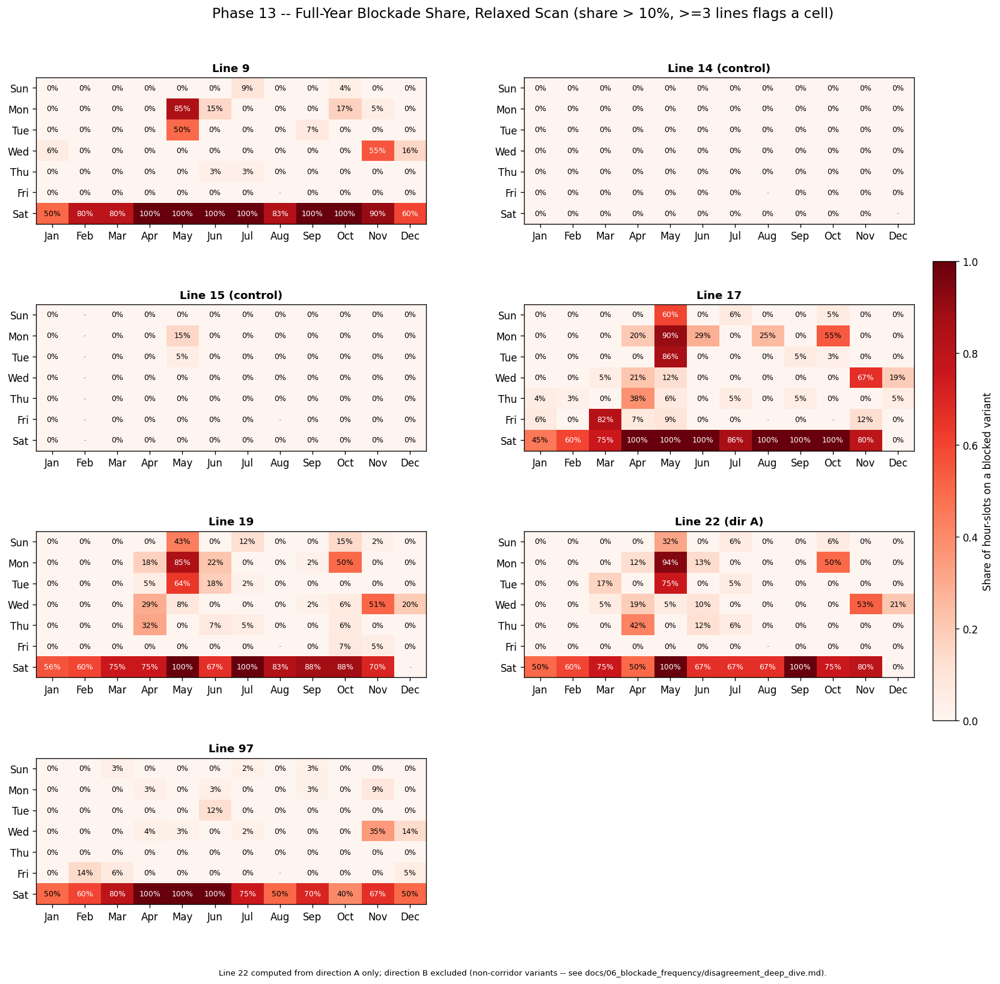
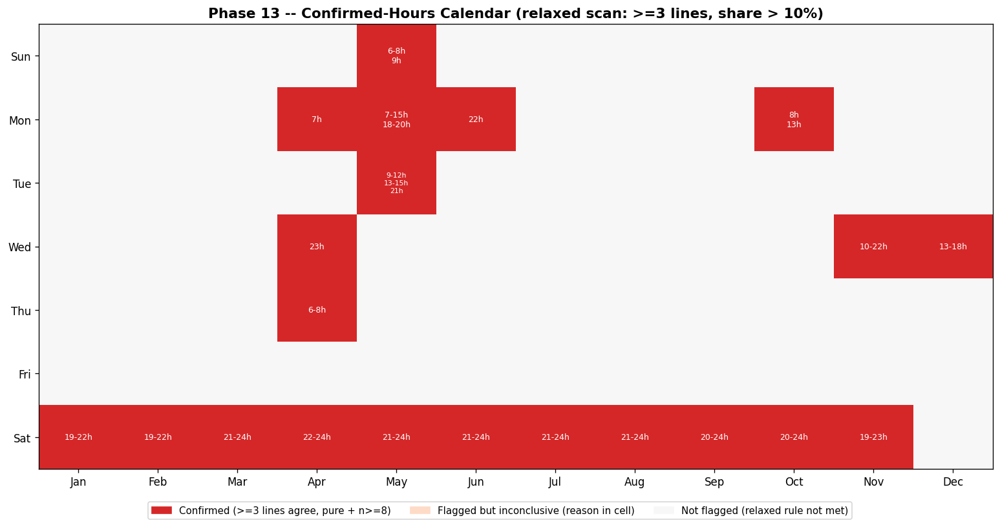

# 13 — Full-Year Blockade Calendar (Relaxed Scan + Confirmed Hours)

**Purpose:** redo and broaden phases 10/11's (month, day-of-week) scan under
a simpler, more permissive rule, then convert every flagged cell's share (%)
into a plain "was there a confirmed blockage, and when" answer — one
calendar covering the whole year, all 7 lines, no manual approval gate
between the scan and the hour-level check. Uses only the effective/merged
classification (`pipeline.variant_merges.build_effective_df_cleaned`,
`variant_type_v2`) on `govData/df_cleaned.csv`, recomputed fresh in this
pass. Reproduce with `python -m pipeline.analyze_full_year_calendar`.

**Line 22 convention (carried over from the central fix):** every share and
every agreement check below computes line 22 from **direction_A only**
(`pipeline.config.LINE_22_SHARE_DIRECTION`) — direction_B can never be
`"blocked"` any more (`variant_merges` forces it to `"non_corridor"`, see
`fix_22b_central_prompt.md`), so pooling it in would still dilute line 22's
real exposure the same way the pre-fix pooled *numerator* used to inflate
it. Direction_B is still drawn in every timeline figure for transparency,
labeled "[excl. from agreement]".

## Part A — Relaxed rescan

**New rule, replacing phase 10's filter (not adding to it):** a
(month, day_of_week) cell is flagged if **≥3 lines independently show
blocked-share > 10%** — no saturation exclusion, no baseline-relative
comparison, no already-known-case exclusion, no n floor for inclusion
(low-n cells are kept and starred, not dropped, unlike phase 10's
treatment of the winter Saturdays).

**21 cells flagged** (full table: [flagged_cells.csv](flagged_cells.csv)):
11 Saturdays (every month with data except December), 3 weekdays already
deep-dived in [docs/11](../11_deep_dive_candidate_windows/README.md) (Nov
Wed, Dec Wed, Oct Mon), and 7 weekdays not previously examined at the hour
level (May Mon, May Tue, May Sun, Jun Mon, Apr Mon, Apr Thu, Apr Wed). May
Mon in particular — excluded entirely by phase 10's saturation filter
because most lines there sit near 90-94% — is now correctly included: the
relaxed rule doesn't care whether a cell is "new," only whether it clears
the bar.

**Control-line sanity check:** line 14 is 0.00% blocked project-wide
(0/1,852 blocks) and line 15 is 0.33% (4/1,205) — neither can
mathematically reach the 10% bar in any single cell, so neither ever
appears in the flagged list. This matches phases 10/11's existing sanity
check.

## Part B — Hour-level confirmation

Every flagged cell (no manual gate) gets the same treatment already
validated in
[disagreement_deep_dive.md](../06_blockade_frequency/disagreement_deep_dive.md)
and [docs/11](../11_deep_dive_candidate_windows/README.md): every
(hour, direction) slot pulled for every elevated line, `variant_type_v2`
tabulated, footprint overlap checked against the **same two footprints
reused verbatim from phase 11** (not redefined):

- Corridor (17/19/22A): 9 stops — `{1073, 1077, 1079, 1080, 1081, 1484,
  1544, 1546, 1575}`
- Aza St. (9/97): 10 stops — `{1060, 1072, 1077, 1079, 1080, 1484, 1543,
  1544, 1546, 1787}`

**Confidence rule for "confirmed":** an hour counts for a line only if (a)
`n ≥ 8` and (b) the slot is **variant-pure** — within that exact (line,
direction, month, day_of_week, hour) group, only one `route_variant_id`
appears in the effective/merged data. A cell-hour is **confirmed** if **≥3
of the cell's elevated lines** each clear that bar (any one direction
counting for a multi-direction line; direction_A only for line 22).
Everything else stays "inconclusive" for that specific hour — not rounded
up.

**Global purity re-verification:** the prompt's brief cited "905
blocked-containing slots, 1 mixed" from an earlier chat session not
reflected anywhere in this repo — that exact number could not be located
in `docs/` or `pipeline/`, so it was recomputed from scratch against the
current (post-fix) classification rather than assumed. This pass finds
**738 blocked-containing slots project-wide, exactly 1 mixed** (line 19
direction_A, November, Wednesday, hour 9:00 — reference n=15 alongside a
blocked variant n=8). The lower count than the cited 905 is expected: the
905 figure likely predates the `fix_22b_central_prompt.md` centralization,
when line 22 direction_B's now-excluded variants still counted as
"blocked." **The qualitative finding — purity is near-universal — holds
regardless of the exact denominator**, and this single known impure slot
sits inside this pass's own November-Wednesday cell (visible as an orange
"IMPURE" cell in [timeline_nov_wed.png](timeline_nov_wed.png), line 19A,
9:00) — correctly excluded from confirmation there.

**All 21 flagged cells reached "confirmed" status** for at least one hour
— none came back fully inconclusive. Full detail: [confirmed_hours.csv](confirmed_hours.csv).

## The calendar

| Month, Day | Confirmed hours | Notes |
|---|---|---|
| Jan–Nov, Sat (11 cells) | 19:00–24:00 range each (19-22h to 22-24h, see table) | Matches the already-documented Saturday evening pattern (docs/06; "blocked 19:00–23:00, regular resumes after" per disagreement_deep_dive.md) |
| Nov, Wed | **10:00–22:00** | See reconciliation below — wider than phase 11's qualitative "~10:00–18:00" |
| Dec, Wed | **13:00–18:00** | Matches phase 11's direction_A-specific 13:00–17:00 finding, one hour wider |
| Oct, Mon | **8:00, 13:00** (two separate single hours) | See reconciliation below — tighter than phase 11's qualitative "~12:00–14:00" |
| May, Mon | 7:00–15:00, 18:00–20:00 | Not previously examined; large, well-supported (n up to 26) |
| May, Tue | 9:00–12:00, 13:00–15:00, 21:00 | Not previously examined |
| May, Sun | 6:00–8:00, 9:00 | Not previously examined |
| Apr, Thu | 6:00–8:00 | Not previously examined |
| Apr, Mon | **7:00 only** | Thin — single-hour confirmation, treat with more caution than the multi-hour blocks |
| Apr, Wed | **23:00 only** | Thin — single-hour confirmation |
| Jun, Mon | **22:00 only** | Thin — single-hour confirmation |

**Reconciliation with phase 11 (required check before publishing):**
phase 13's confirmation rule is stricter and more precisely defined than
phase 11's visual reading of its timeline figures (a hour only confirms
if ≥3 lines are *simultaneously*, individually pure+n≥8+blocked — not "the
cell looks mostly red"). Where the two differ, it is this mechanism, not a
bug:

- **Nov Wed (10–22h vs. phase 11's "~10:00–18:00"):** phase 11's number was
  an eyeballed description of the densest red block; several lines still
  had at least one direction confirmed blocked through 19:00–22:00 (visible
  in [timeline_nov_wed.png](timeline_nov_wed.png)), so the precise rule
  extends the confirmed range. The underlying conclusion — a real,
  coordinated, multi-hour event — is unchanged and, if anything,
  strengthened by the wider confirmed range.
- **Oct Mon (8h, 13h vs. phase 11's "~12:00–14:00"):** the exact
  3-line-simultaneous rule is *stricter* here, not wider. At 12:00, line
  22A was still on its reference variant (not yet detoured); at 14:00,
  line 17 had already reverted — so only **13:00** has all three corridor
  lines (17, 19, 22A) simultaneously confirmed. Separately, **8:00**
  confirms via a different trio (9, 19, 22) — this is the distinct,
  unrelated early-morning cluster phase 11 already flagged as
  uncoordinated with the midday corridor event, now precisely pinned to a
  single hour instead of a loose range. **Net effect: phase 13 refines
  phase 11's eyeballed block into two precise, defensible single-hour
  confirmations reflecting two different mechanisms — it does not
  contradict phase 11's cautious reading of this cell (which already
  flagged line 17's n=11 as thin and line 9 as likely uncoordinated).**
- **Dec Wed (13–18h vs. phase 11's 13:00–17:00):** a one-hour extension,
  consistent within the same margin as Nov Wed's.

## N-anomaly report

For each confirmed hour, its `n` was compared to the same (line,
direction)'s nearest reference-variant hour on the same (month,
day_of_week); only ratios ≥2× or ≤0.5× are reported (17 cases — full
table: [n_anomaly_report.csv](n_anomaly_report.csv)).

| Month, Day | Line/dir | Blocked hour (n) | Nearest reference hour (n) | Ratio |
|---|---|---|---|---|
| May Mon | 19B | 18:00 (n=34) | 24:00 (n=6) | 5.67× |
| May Mon | 19B | 19:00 (n=15) | 24:00 (n=6) | 2.50× |
| Jul Sat | 17B, 97B (×2), 22A | 21:00–23:00 (n=8–16) | 24:00 (n=4–8) | 2.0–2.14× |
| Sep Sat | 97A (×3) | 20:00–22:00 (n=15) | 24:00 (n=7) | 2.14× |
| Nov Wed | 19A/19B, 22A, 17B (×2) | 16:00–21:00 (n=8–36) | 20:00–24:00 (n=4–15) | 2.0–2.4× |
| Apr Wed | 19A/19B | 23:00 (n=10–12) | 24:00 (n=5) | 2.0–2.4× |

**Read as routine ridership variation, not a coverage-gap or fabrication
signal:** every case compares a daytime/evening confirmed-blocked hour
against a near-midnight (23:00–24:00) reference-variant hour, which
naturally carries far fewer scheduled rides project-wide. None shows the
categorical, all-or-nothing signature that flagged the real December
line-22B artifact in phase 11 (where a variant went from ~1–14% to 100% of
a month's trips with zero partial adoption) — these are smaller, one-sided
ratios consistent with ordinary late-night ridership drop-off.

## Outputs

- `blockade_frequency_full_<line>.png` (all 7 lines) + `blockade_all_lines_grid_full.png` — relaxed-scan heatmaps.
- `all_lines_month_day_share.csv`, `flagged_cells.csv` — Part A's full scan and ranked flagged-cell table.
- `timeline_<month>_<day>.png` — one per flagged cell (21 total), confirmed hours outlined in black.
- `confirmed_hours.csv`, `confirmed_hours_calendar.png` — the calendar deliverable.
- `n_anomaly_report.csv` — the ≥2×/≤0.5× cases only.

## Verification

- Every share/n was recomputed directly from `govData/df_cleaned.csv` via
  `build_effective_df_cleaned` in this pass — nothing carried over
  unverified from docs/10 or docs/11 (the Nov Wed / Dec Wed / Oct Mon
  per-line shares above match docs/11's already-fixed direction_A-only
  numbers exactly: 22 at 52.6%/21.1%/50.0% respectively).
- Phase 11's three cells reappear in Part A's relaxed list and were
  reconciled against phase 11's hour ranges above — no unexplained
  discrepancy; differences are attributable to phase 13's stricter,
  precisely-defined per-hour rule, not a bug.
- Control lines 14/15 never reach "confirmed" (or even "flagged") status
  anywhere on the calendar — 0.00% and 0.33% blocked project-wide,
  mathematically incapable of clearing the 10% bar.
- Spot-checked: Jan Sat (19:00–22:00) and Aug Sat (21:00–24:00) both land
  as confirmed with hour ranges matching the already-documented Saturday
  evening pattern (disagreement_deep_dive.md: "blocked 19:00–23:00,
  regular resumes after"), citing that doc rather than re-deriving it.

**Sources:** `govData/df_cleaned.csv`, `govData/variant_summary.csv`,
`govData/variant_merges.json`, `pipeline/variant_merges.py`,
`pipeline/config.py`, `pipeline/analyze_deep_dive_windows.py` (footprint
reuse), `pipeline/analyze_full_year_calendar.py` (this phase's script),
[docs/10_candidate_windows](../10_candidate_windows/README.md),
[docs/11_deep_dive_candidate_windows](../11_deep_dive_candidate_windows/README.md),
[docs/06_blockade_frequency/disagreement_deep_dive.md](../06_blockade_frequency/disagreement_deep_dive.md),
`prompts/full_year_blockade_calendar_prompt.md`,
`prompts/fix_22b_central_prompt.md`.
